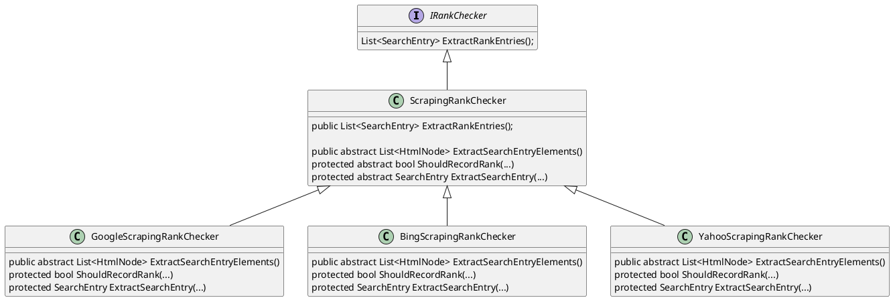
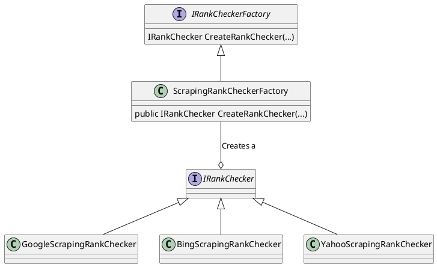

[](https://opensource.org/licenses/MIT)
[](https://docsify.js.org/)
[](https://shields.io)

# Project Structure

Inside the `Solution` folder is the various projects, and a solution file to open those projects for Visual Studio. Below table describes each project and their purpose:

| Project | Purpose | Why? |
| --- | --- | --- |
| MitchRankChecker.EntityFramework | A .Net Core Entity Framework project. Contains the database `migration` files. You can run the `dotnet ef` commands against this project. | It's not a good idea to put Entity Framework (EF) inside the web applications, especially if multiple applications uses the same model and database. Thus, EF was separated from the model project to keep it standard and compatible. It's possible to create a .Net Frameworks Entity Framework using that model project to work with older ASP.Net Framework applications. |
| MitchRankChecker.Model | Models (AKA entities) that maps properties to their corresponding table in the database. | Models are placed as a separate project for modularity purposes and due to multiple projects needing to use the models. |
| MitchRankChecker.Mvc | The MVC web application, providing the front-end hooking up to the Web API. | To provide the front-end for the user to interact with to perform rank checking. |
| MitchRankChecker.RankChecker | A `standard class library` that does the actual rank checks. | To keep it decoupled from a single application, it was designed as its own separate class library project. |
| MitchRankChecker.RankCheckerTest | Automated tests for the rank checker classes. | Simple levels of automated unit tests reduces bugs resulting from regression. |
| MitchRankChecker.WebApi | The Web API web application to manipulate and return data from the database. | Web API is cross-platform, meaning a mobile app, desktop app, etc can use the Web API, not just the web application. |
| HostedServiceBackgroundTasks | Used to run background services. Useful to queue and run rank check processes which a single process can take over 10 seconds. | DotNet core 3.0 is expected to have queued hosted services built in. However the current solution for dotnet core 2.X is create your own set of classes as detailed in this [MSDN article](https://docs.microsoft.com/en-us/aspnet/core/fundamentals/host/hosted-services?view=aspnetcore-2.2). Hence this project. |

The `.vscode` folder comes with pre-configured files to debug the applications using **Visual Studio Code**.

# Running the Project

To run the MVC Application, you need to run the Web API application simultaneously.
Below are the instructions on how this can be accomplished.

## Visual Studio

1. Open the `/Solution/MitchRankChecker.sln` file with Visual Studio.
2. Right click on the Solution > Rebuild All

   

3. Right Click the `MitchRankChecker.WebApi` Project > Debug > Start New Instance
   
   

4. Right Click the `MitchRankChecker.Mvc` Project > Debug > Start New Instance
   
   

## DotNet CLI

1. Open up `Powershell`.
2. Change your directory to the Web API project, i.e:
   ```powershell
   cd <PathToWhereThisReadMeIs>/Solution/MitchRankChecker.WebApi
   ```
3. Run the below command to build the application. This should also implicitly restore any missing packages:
   ```powershell
   dotnet build
   ```
4. Run the below command to host the application:
   ```powershell
   dotnet run
   ```
5. Open up another `Powershell` instance.
6. Change your directory to the Web MVC project, i.e:
   ```powershell
   cd <PathToWhereThisReadMeIs>/Solution/MitchRankChecker.Mvc
   ```
7. Repeat steps 3-4 to run the Mvc application.
8. Navigate to [https://localhost:44306](https://localhost:44306) to try the application.

# Code Documentation

## Web API

After running the project, you can navigate to Web API application through [https://localhost:44305](https://localhost:44305) to browse and view the API documentation.

The documentation utilises `Swashbuckle` to generate documentation. For more information, see [here](https://docs.microsoft.com/en-us/aspnet/core/tutorials/getting-started-with-swashbuckle?view=aspnetcore-2.2&tabs=visual-studio).

## Code Documentation

TODO

# MVC Project - Libman Package Manager

Microsoft `Libman package manager` is used to manage client-side frameworks.
Below steps are optional, as the client-side package files are checked in. However, if you accidentally deleted it or modified the `libman.json` file, you can follow the below steps:

1. Run the below command to install the `libman` tool, used to manage client-side packages:
   ```powershell
   dotnet tool install -g Microsoft.Web.LibraryManager.Cli
   ```
2. Run the below command to restore the client-side packages:
   ```powershell
   libman restore
   ```

For more commands and information, see this [Microsoft Article](https://docs.microsoft.com/en-us/aspnet/core/client-side/libman/libman-cli?view=aspnetcore-2.2).

# Design Considerations

## Database

The chosen database is `SQLite` file database, which is lightweight and cross-platform. For realistic use, a real database would need to be used, however for simplicity purposes and to ease the set-up process, SQLite was used.

If you intend to switch to another database (e.g. MySQL, MSSQL) then follow the below steps:

1. Depending on which database provider you want to use, install a [database provider package](https://docs.microsoft.com/en-us/ef/core/providers/).
   * You can use the command `dotnet add package Microsoft.EntityFrameworkCore.<YourProvider>`.
     For example, `dotnet add package Microsoft.EntityFrameworkCore.MySql`.
   * For more information on providers, see this [article](https://docs.microsoft.com/en-us/ef/core/providers/).

2. Update the following files:
   * `MitchRankChecker.EntityFramework/DesignTimeTbContextFactory.cs`
       * Update the connection string
       * Change the database provider
           * You can use the command `dotnet add package Microsoft.EntityFrameworkCore.<YourProvider>`.
             For example, `dotnet add package Microsoft.EntityFrameworkCore.MySql`.
           * For more information on providers, see this [article](https://docs.microsoft.com/en-us/ef/core/providers/).
   * `MitchRankChecker.WebApi/appsettings.json`
       * Update the connection string
   * `MitchRankChecker.WebApi/Startup.cs`
       * Database provider needs to be updated, i.e:
         From:
         ```csharp
         public void ConfigureServices(IServiceCollection services)
         {
           //...
           services.AddDbContext<RankCheckerDbContext>(options => options.UseSqlite(connection));
           //...
         }
         ```
         To:
         ```csharp
         public void ConfigureServices(IServiceCollection services)
         {
           //...
           services.AddDbContext<RankCheckerDbContext>(options => options.Use<YourProvider>(connection));
           //...
         }
         ```
         For example:
         ```csharp
         public void ConfigureServices(IServiceCollection services)
         {
           //...
           services.AddDbContext<RankCheckerDbContext>(options => options.UseMySql(connection));
           //...
         }
         ```

## Design Patterns

Two design patterns was applied within the `MitchRankChecker.RankChecker` project. They are:
* `Template Pattern`
* `Abstract Factory Pattern`

### Template Pattern

We use the template pattern to lay down the common code used between the different `RankChecker` classes.
It also provides a skeleton for the functionality differences of each `RankChecker` class to override, as rank checkers for different search engines would require different operations.



Note async modifiers and methods were ommitted to reduce size and complexity of diagram.

### Abstract Factory Pattern

* To instantiate a specific implementation of `IRankChecker` depending on runtime conditions, e.g. user inputs.
* Chosen over the simpler `Factory pattern` and `Factory method pattern` due to the following reasons:
    * Adds more flexibility for different types of factories to use.
    * Rank checking via scraping is only one way of implementing a rank checker. In the future, rank scraping via other means (e.g. using the `search web API` directly) would be possible. In that situation, it's highly possible that we can have another factory (e.g. `ApiRankCheckerFactory`).

The abstract factory pattern was implemented as such:
* `ScrapingRankCheckerFactory` inherits from `IRankCheckerFactory`
* `ScrapingRankCheckerFactory` can create an `IRankChecker` object based on run-time conditions
    * In this case, the actual deepest class the object inherits from is either `GoogleScrapingRankChecker`, `YahooScrapingRankChecker` or `BingScrapingRankChecker`

The above rules can be shown using the below UML class diagram:



### Why Not Repository?

Although popular, the controversial `Repository` pattern was not applied, for below reasons:
* Entity Framework concept of `DbSets` overlaps with the pattern on a large basis.
* Popularised from the concept of **DDD (Domain Driven Design)**. DDD is a good approach for complex domain issues, however this project domain logic is quite simple, and doesn't warrant using the DDD approach.
* Additional effort required.

# Notes and Further Work

* The rank checking does not count ads search results. They appear on every page, and thus isn't feasible to be included as part of the rank checking process.
    * It's possible to implement a RankChecker that does a rank check with ads search results only.
* A real-time processing framework (e.g. `SignalR`) can be used to alert a user when their background job is finished, instead of having to refresh the page or data grid.
* Due to time constraints:
    * A logging library isn't included.
    * The fundamental concept of `HATEOAS` wasn't implemented for the API.
    * Authentication and authorisation wasn't implemented, due to the amount of effort to implement a proper authentication system that allows for managing users, roles, permissions, and/or claims.
    * No complicated NPM and Webpack installation. Instead, used `LibMan`, which is Microsofts package manager. Easier to setup, but for complicated use cases, NPM and webpack is the better approach.
    * Client-side framework (i.e. VueJS, react, Angular) was not used, as it'd also require NPM and webpack for an optimal set up, taking time.